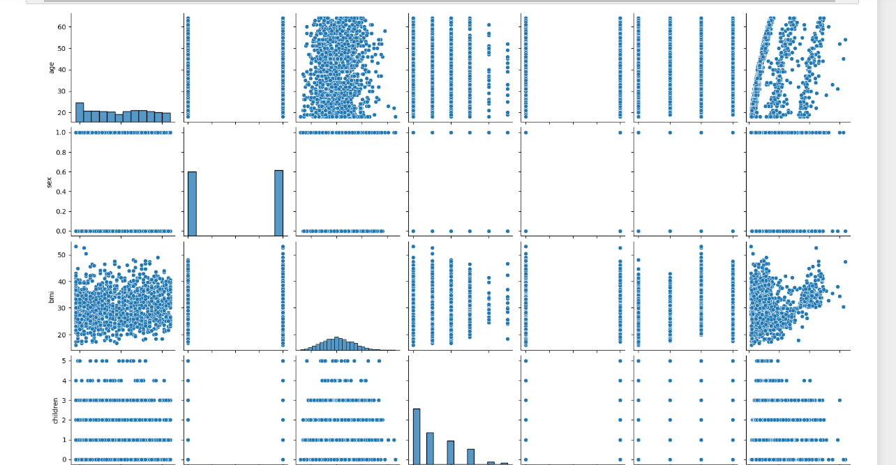

# Project-solution-statistical-learning
Hypothesis testing of an insurance company to determine the charges 
paid been determined by some factor that are likely to cause its rises
e.g(Region, BMI, Age, Sex,No of children, smoking with respect to 
the charges)
# Hi, I'm Ajet! 👋


# **Installation**

To install the libraries used in this project, Follow the instructions bellow

```bash
  pip install numpy
  pip install pandas
  pip install matplotlib
  pip install seaborn
  pip install statsmodels
  pip install scipy
```
    
## **Running Tests**

To run tests, run the following command

### *Make sure you import all this file before running the program*
```bash
import numpy as np
import pandas as pd
import matplotlib.pyplot as plt
import seaborn as sns
import scipy.stats as stats
import statsmodels.api as sm
```


## Screenshots




## 🚀 About Me
I'm a full stack data scientist...


## 🔗 Links
[](https://github.com/OlawaleAjet/olawaleajet)
[](https://www.linkedin.com/in/qudus-ajetunmobi-5915bb239/)
[](https://twitter.com/ajety54)


## More of  me
💬 started as an Electrical Electronics Engineer

👩‍💻 Bsc. Electrical Engineer, second class upper with honor

🧠 I'm currently working on Data annotation, I'm currently learning
 Machine learning

👯‍♀️ I'm looking to collaborate on anything

📫 Reach out to me on twitter and i will do my best to help

🤔 ...

💬 ...

😄 ...

⚡️ ...


## 🛠 Skills

1. python
2. Data science
3. Machine Learning
4. Deep Learning
5. AI
with little bit of  HTML, CSS 😉..

## Feedback

If you have any feedback, please reach out to me via twitter

